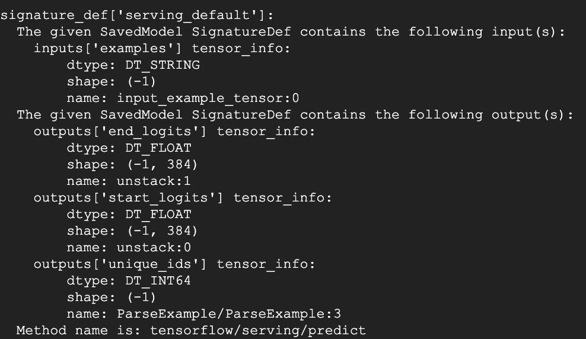

# Tensorflow Serving for Korean MRC

This repository is for Korean MRC service methods using Tensorflow Serving.

I developed the Whale extension app using Tensorflow Serving and opened it to the link below.

* Whale extension, 한국어 MRC : https://store.whale.naver.com/detail/hkmamenommegcobnflgojmfikpkfgjng

* Chrome extension, 한국어 MRC : 준비중

<br>

## 0. Tensorflow Serving

Serving 이란 추론을 위해 우리가 학습한 모델을 사용하거나 서비스하는 기술을 말한다. 예를 들어, 아래 그림에 클라이언트는 분류해야 하는 입력 이미지(e.g. 고양이)가 있다. 이 이미지를 특정 인코딩 형식으로 변환하여, 서버 측에 전달한다. 서버에는 학습된 모델을 호출하여, 추론 결과를 클라이언트로 전달한다. 이러한 일련의 과정을 Serving이라고 한다.


<br>


## 1. Export Estimator model with BERT


### 1.1. Export Model 

Estimator model을 export할 경우 <b>export_savedmodel</b>을 활용하여, 모델을 pb 형태로 구성해야 한다. export_savedmodel의 매개변수는 아래와 같다. 

 - export_dir_base : pb 저장 경로 
 - checkpoint_path : ckpt 모델 경로(e.g. bert_model.ckpt)
 - serving_input_fn : 모델의 입력 스키마 정의 
 
```python

estimator.export_savedmodel(export_dir_base="output_dir/bert-24-layer",
                             checkpoint_path=init_checkpoint,
                             serving_input_receiver_fn=serving_input_receiver_fn)

def serving_input_receiver_fn():
    feature_spec = {
		"unique_ids": tf.FixedLenFeature([], tf.int64),
		"input_ids": tf.FixedLenFeature([max_seq_length], tf.int64),
		"input_mask": tf.FixedLenFeature([max_seq_length], tf.int64),
		"segment_ids": tf.FixedLenFeature([max_seq_length], tf.int64),
	}

    serialized_tf_example = tf.placeholder(dtype=tf.string,
                                           shape=[None],
                                           name='input_example_tensor')
    receiver_tensors = {'examples': serialized_tf_example}
    features = tf.parse_example(serialized_tf_example, feature_spec)
    return tf.estimator.export.ServingInputReceiver(features, receiver_tensors)
```

### 1.2. Load Model 

생성된 pb파일은  <b>from_saved_model</b>을 사용하여 호출한다. 모델을 load하고 prediction 하는 방법은 아래와 같다. 

```python

predictor_fn = tf.contrib.predictor.from_saved_model(export_dir="output_dir/bert-24-layer")

predictions = predictor_fn({'examples': examples})

```

<br>

## 2. TensorFlow Serving Server with Docker

Tensorflow serving을 위해서는 위에서 생성한 pb 파일을 활용하여, Tensorflow serving server를 실행해야 한다. 이를 위해 관련 Docker 이미지를 이용해 실행하는 방법에 대해서 설명한다. 먼저 아래 명령어를 통해 최신 TensorFlow Serving Docker 이미지를 가져온다. 또는 서비스 하고자 하는 Tensorflow 버전에 맞는 Docker 이미지를 가져와서 사용하면 된다. ([docker hub](https://hub.docker.com/r/tensorflow/serving/tags/))

```bash
$ docker pull tensorflow/serving (CPU)

$ docker pull tensorflow/serving:latest-gpu (GPU)
```

본 repository에서는 nvidia-gpu를 이용한 docker 이미지 실행 방법에 대해서만 설명한다. 설치된 Docker를 이용하여, Tensorflow Serving server를 실행하는 명령어는 아래와 같다. nvidia-gpu를 사용하기 위해서는 반드시 <b> --runtime=nvidia</b>를 입력해줘야 한다. 

- port : port 번호
- source : pb모델의 경로 
- target : client에서 post 형태로 호출할 모델 이름 (e.g. http://ip:port/v1/models/bert:predict)

```python
docker run --runtime=nvidia -p 8501:8501 --mount type=bind,source=output_dir/bert-24-layer,
target=/models/bert -e MODEL_NAME=bert -t tensorflow/serving:latest-gpu &
```
<br>


## 3. TensorFlow Serving REST API

실행된 Tensorflow Serving server에 Prediction 하기 위해서는 POST 형태로 호출해야 한다. 특히 json 변수에는 아래 정보가 포함되어 있어야 한다.

- signature_name : <b>saved_model_cli</b> 명령어를 통해 pb파일의 signature_name을 확인해야 한다. 
 
 ```bash
$ saved_model_cli show --dir bert-24-layer/1/ --all
```



<br>
 
- instances : prediction 하고자 하는 example(paragraph, question) 값을 입력한다. SerializeToString으로 된 example의 경우 반드시 base64 인코딩을 해서 전달해야 한다. 

```python
resp = requests.post('http://ip:port/v1/models/bert:predict', 
		json={
			"signature_name": "serving_default",
                	'instances': [
                   	 {'examples': {'b64': base64.b64encode(example.SerializeToString()).decode('utf-8')}}
                ]})
resp.raise_for_status()


start_logits = json.loads(resp.text)["predictions"][0]["start_logits"]
end_logits = json.loads(resp.text)["predictions"][0]["end_logits"]
```
<br>

## 4. Reference 

https://hub.docker.com/r/tensorflow/serving/tags/

https://www.tensorflow.org/tfx/serving/docker

https://stackoverflow.com/questions/51776489/correct-payload-for-tensorflow-serving-rest-api

https://medium.com/google-developer-experts/building-robust-production-ready-deep-learning-vision-models-in-minutes-acd716f6450a

<br>
<br>


